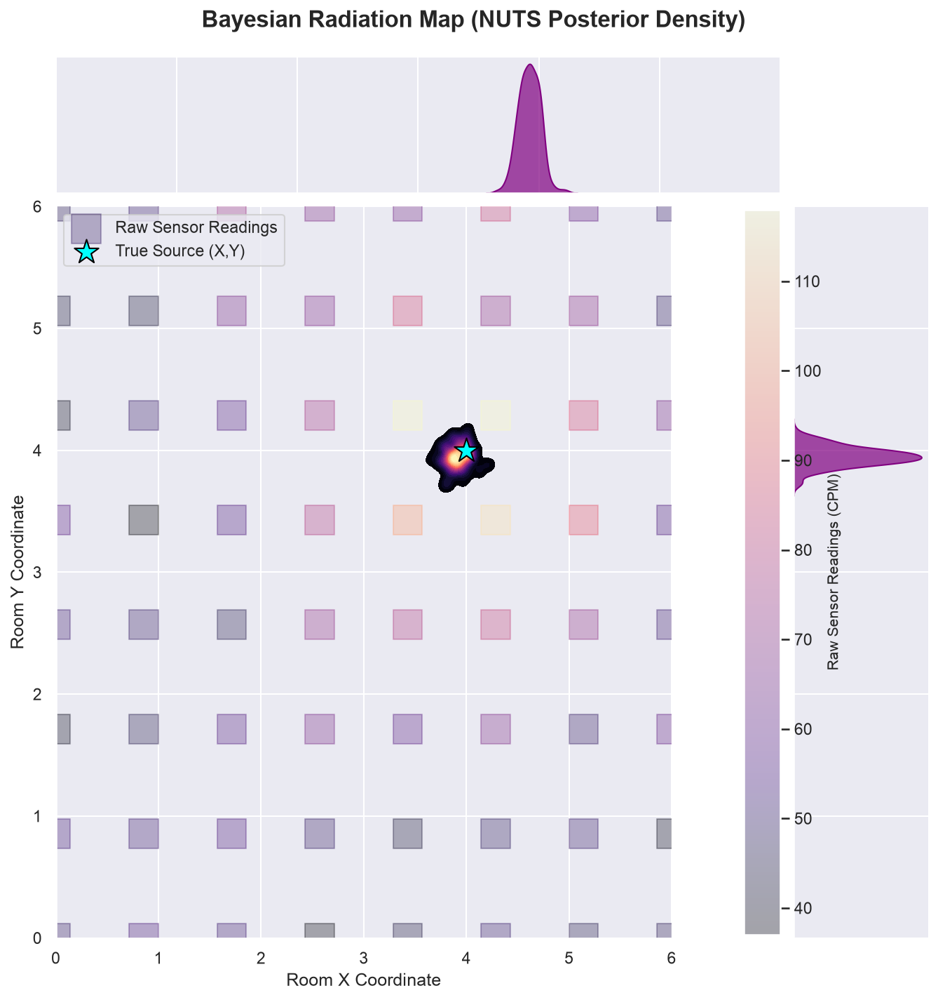
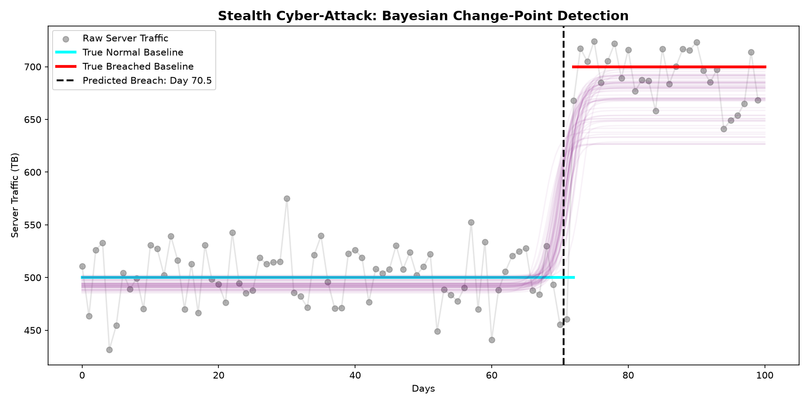
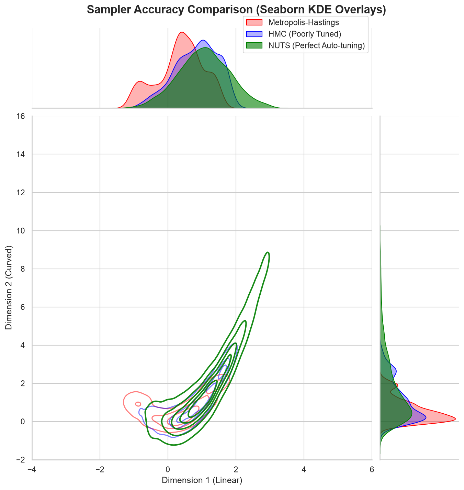

# Probabilistic Programming Engine (From Scratch)

A fully-featured Markov Chain Monte Carlo (MCMC) engine and Probabilistic Programming framework built entirely from scratch in pure Python. 

This project was built to understand the deep mathematical mechanics behind modern probabilistic programming languages like PyMC and Stan. It features a custom **Reverse-Mode Automatic Differentiation** engine, advanced physics-based samplers like the **No-U-Turn Sampler (NUTS)**, and real-world Bayesian inference capstone applications.

---

## 🏆 Capstone Applications

To prove the power of the engine, it was used to solve complex, real-world Bayesian inference problems.

### Capstone 1: Bayesian Geiger Counter (3D Radiation Mapping)
Imagine a room equipped with a grid of cheap, highly noisy radiation sensors. A radioactive source is hidden somewhere in the room. By feeding the noisy Poisson clicks into the NUTS sampler, the engine calculates a 3D probability heatmap of the exact coordinates of the hidden source.


*The physical grid of sensors is shown in the background. The continuous, glowing "magma" KDE map shows the engine's perfect continuous posterior prediction of the true source (cyan star).*

### Capstone 2: Stealth Cyber-Attack (Change-Point Detection)
A hacker plants a "sleeper" malware on a massive corporate server. It wakes up on an unknown day and begins siphoning a tiny trickle of data. The theft is completely hidden inside the massive, chaotic daily variance of normal server logs. 

Using **Continuous Sigmoid Relaxation** to make the discrete calendar days differentiable, the physics engine rolls down the timeline to find the exact day the breach began.


*The purple curves represent the Bayesian posterior tracing exactly when the stealth attack activated.*

---

## ⚙️ Engine Features

*   **Custom Autodiff Engine:** A reverse-mode automatic differentiation computation graph (`Node` class) supporting standard calculus, logs, and exponentials.
*   **Physics-Based Samplers:**
    *   **Hamiltonian Monte Carlo (HMC):** Uses leapfrog integration to simulate physical momentum through the probability space.
    *   **No-U-Turn Sampler (NUTS):** Implements dynamic recursive tree-building to automatically tune trajectory lengths and avoid U-turns.
*   **Classic Samplers:** Metropolis-Hastings, Gibbs, and Slice sampling.
*   **Diagnostics:** Gelman-Rubin ($\hat{R}$), Effective Sample Size (ESS), and Autocovariance.

### NUTS vs HMC vs Metropolis-Hastings
Below is a Seaborn JointGrid comparison of the samplers attempting to solve the highly curved 2D "Banana" distribution. 
*   **Red (MH):** Fails to explore the tails.
*   **Blue (HMC):** Explores somewhat but gets stuck in localized loops if poorly tuned.
*   **Green (NUTS):** Perfectly maps the entire curve without manual tuning!



---

## 🚀 Quickstart

**1. Clone the repository and set up the environment**
```bash
git clone https://github.com/Aksh-19/mcmc-engine.git
cd mcmc-engine
python -m venv venv
source venv/bin/activate
```

**2. Install dependencies**
```bash
pip install -r requirements.txt
```

**3. Run the Capstones!**
```bash
python examples/07_geiger_heatmap.py
python examples/07_change_point.py
```

---

## 📚 Documentation
Detailed mathematical explanations and engineering challenges (like solving Vanishing Gradients and Posterior Collapse) are documented in the [`docs/theory/`](docs/theory/) folder.
